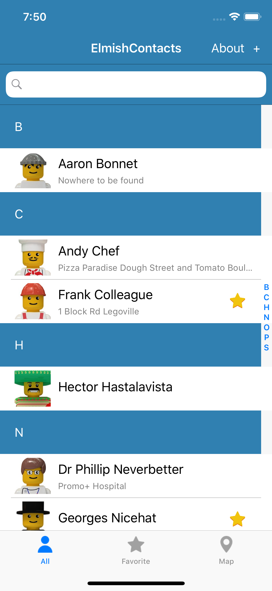
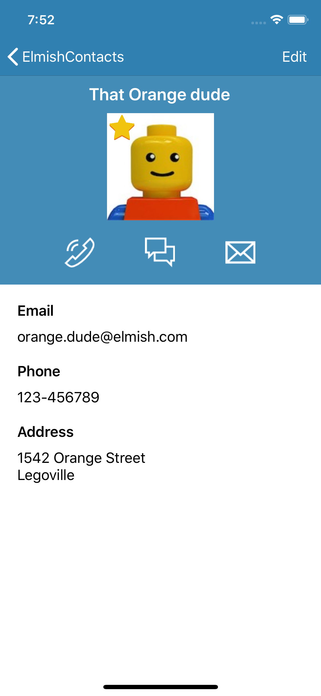
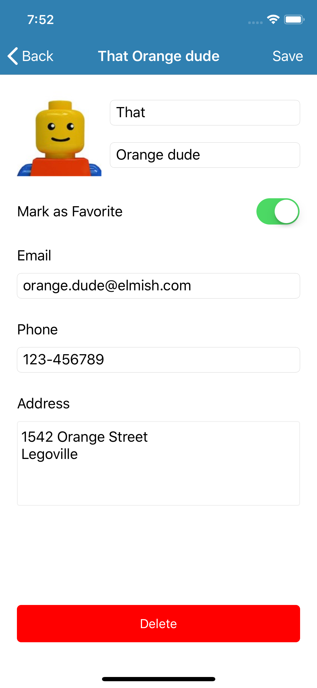
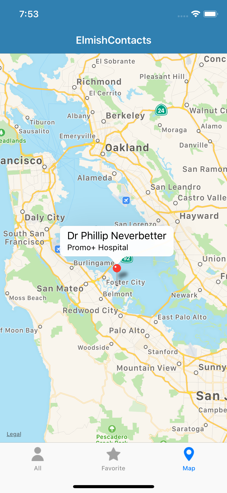

# ElmishContacts
 

Sample contact manager app entirely written in F# and [Fabulous](https://github.com/fsprojects/Fabulous)  

The purpose of this sample was to give a test drive to Fabulous, and showcase :
- Why F# and the Elm paradigm are great to make apps
- How easy it is to use
- How to use SQLite with Fabulous
- How to make multipages app
- How to use the Maps control
- How to make custom controls
- And finally, check if it could be used for real production apps

ElmishContacts is now live in the stores!  
 

   

## Running the sample
If you want to build and run your own version of ElmishContacts, you will need to get a key for Google Maps on Android.
Follow the instructions here: https://docs.microsoft.com/en-us/xamarin/android/platform/maps-and-location/maps/obtaining-a-google-maps-api-key

Once you have a key, simply replace `REPLACE_WITH_GOOGLE_API_KEY` in the keys.xml file in the Android project: https://github.com/TimLariviere/ElmishContacts/blob/master/ElmishContacts.Android/Resources/values/keys.xml#L3

If you have an [AppCenter](https://appcenter.ms) account, you can also enable analytics and diagnostics by setting your own app secret keys in the AppCenter.fs file:
https://github.com/TimLariviere/ElmishContacts/blob/master/ElmishContacts/AppCenter.fs#L13

Follow the instructions here: https://docs.microsoft.com/en-us/appcenter/sdk/getting-started/xamarin#43-replace-the-placeholder-with-your-app-secret
